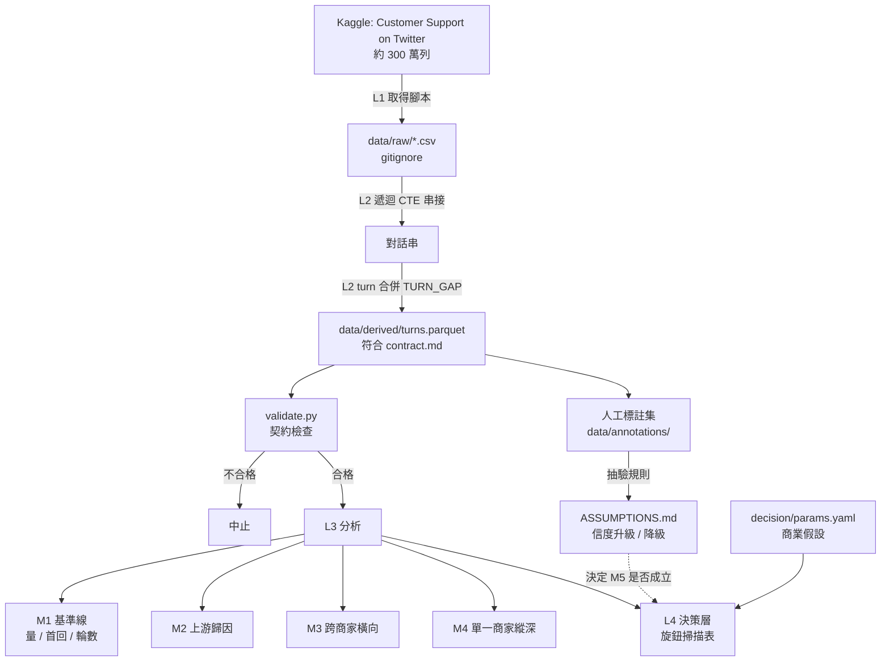

# 架構

> 本檔管**形狀**：分層、職責、資料流、技術棧。
> 推導規則的內容與已知失效情形在 `ASSUMPTIONS.md`；決策記錄在 `../prepare.md`。

---

## 四層

| 層 | 職責 | 不做什麼 |
|---|------|---------|
| **L1 取得** | 下載原始資料、落到 `data/raw/`、記錄取得日期與來源 | 不清洗、不改欄位。原始檔保持可重新取得 |
| **L2 契約** | 對話串重建、turn 合併、推導欄位計算，產出符合 `data/contract.md` 的表 | 不算指標、不下結論 |
| **L3 分析** | 從契約表算指標（時效、輪數分布、上游歸因、跨商家比較） | 不讀原始欄位、不決定門檻 |
| **L4 決策** | 讀 `decision/params.yaml` 的商業參數，輸出旋鈕掃描表 | 不輸出單點建議（← `prepare.md` CS-006） |

**L2 是唯一能碰原始欄位的層**。L3／L4 讀不到 `data/raw/`，這是靠目錄邊界與 review 維持的約定，
不是靠程式強制——真正的強制在 `scripts/validate.py`（M1 落地）：契約表不合格就不准往下跑。

---

## 資料流



**兩條線刻意分開畫**：左邊是資料流，右邊（`H → I`）是**驗證流**。
推導欄位的信度只能由驗證流升級，不能由資料流自己宣稱——這是 CS-005 在架構上的形狀。

---

## 目錄結構

```
customer-support-ops/
├── data/
│   ├── contract.md          對話事件契約（跨層唯一介面）
│   ├── raw/                 原始資料，gitignore
│   ├── derived/             契約表產物，gitignore
│   └── annotations/         人工標註集，進 repo（體積小且是資產）
├── scripts/                 L1 取得 + validate.py            ← M1 落地
├── analysis/                L3                               ← M1 起陸續落地
├── decision/
│   ├── params.yaml          商業假設（人為接軌點）           ← M5 落地
│   └── policy.py            旋鈕掃描                         ← M5 落地
├── docs/
│   ├── ARCHITECTURE.md      本檔
│   ├── ASSUMPTIONS.md       推導規則、參數來源、已知失效情形
│   └── FINDINGS.md          分析主張（人寫）                 ← M2 起
├── figures/                 圖表產物，gitignore
├── CLAUDE.md / README.md / CHANGELOG.md / prepare.md
```

v0.1.0 只有 `data/contract.md`、`docs/`、四份根層文件。其餘目錄在對應里程碑才建，
**不預先建空資料夾**——空目錄看起來像做過了。

---

## 技術棧

| 層 | 選型 | 為什麼 |
|---|------|-------|
| DuckDB | L1／L2 | 300 萬列的遞迴串接，pandas 會爆記憶體；且 SQL 的串接邏輯可逐行核對 |
| pandas | L3 小結果集 | 聚合後的資料量小，用熟悉的工具 |
| matplotlib | 圖表 | 產物是分析報告不是網頁 |
| PyYAML | L4 參數 | 商業假設要能被人單獨改，不埋在程式碼裡 |

**沒有的東西**：後端、資料庫服務、前端框架、排程、LLM 推論。
每一項都與本專案要回答的問題無關，加進來只會稀釋分析密度。

---

## 里程碑與出口條件

出口條件分層寫，**各層可以分別死**——某一層不通過就砍那一層，不是砍整個專案。

### M1 · 數據整理

- **交付**：L1 取得腳本、L2 契約表、`validate.py`、基準線（各品牌量／首回中位數／輪數分布）、
  `ASSUMPTIONS.md` 首版、人工標註集 30 串
- **出口**：
  ① 對話串重建後**抽 10 串人工核對無誤**
  ② 串接失敗率 < 5%（孤兒訊息、指向不存在的父節點）。超過即代表這份資料撐不住後面四個里程碑，
     此時止損只賠掉 M1
  ③ **交棒訊號可辨識性關卡**（← `prepare.md` CS-003）：30 串人工標註中，
     兩位標註者（或同一人隔日重標）對「第幾輪交棒」的一致率須達可接受水準。
     **標不出來 → M5 從規劃中砍掉**，專案定位改為「客服營運分析」，且此事寫進 README
- **不做**：情緒分析、文字分類、任何模型

### M2 · 優化流程（上游歸因）

- **交付**：`issue_category` 推導規則、上游歸因分析、`FINDINGS.md` 首版、
  一份具體流程改動建議（附影響量級）
- **出口**：能寫出**至少一條反直覺、且指得回資料的結論**。
  若跑完只得到「回應要更快、分類要更細」，本階段沒有產出價值——
  **停在 M1 當一份乾淨的資料整理作品**，不硬往下做
- **不做**：任何交棒相關分析

### M3 · 商家帳號 · 跨商家橫向基準

- **交付**：跨品牌基準比較（分位數而非排名）、各品牌離群指標的解釋
- **出口**：能對至少一個品牌的離群值給出**指得回資料的解釋**，而不只是「它比較慢」。
  解釋不出來就只是一張排行榜，該退回 M2 收尾
- **不做**：單一商家的縱深診斷

### M4 · 商家帳號 · 單一商家縱深

- **交付**：挑一家做深——該品牌的問題結構、時段負荷、上游歸因清單
- **出口**：產出的建議要能被「這家公司的客服主管會不會照做」這個問題檢驗。
  若所有建議都是「多請人、回快點」，代表縱深沒有比橫向多給出東西，本階段可砍
- **不做**：真的做一個後台介面（重心會從分析滑向產品設計 ← CS-007 的代價欄）

### M5 · 人機交棒決策

- **前提**：M1 出口③ 通過。未通過則本里程碑不存在
- **交付**：`params.yaml`、`policy.py`、旋鈕掃描表、`FINDINGS.md` 的決策章節
- **出口**：掃描表的**兩端要各自失效得出來**——門檻趨近 0（全轉人工，人力爆掉）、
  趨近無限（全丟給機器，未解決率爆掉），中間才有取捨。
  **掃不出這條曲線就等於沒有決策層**，此時交付降級為「交棒訊號的偵測與描述」，
  並在 README 誠實寫明決策層未成立
- **不做**：訓練分類器比準確率、A/B 建議、單點門檻建議
